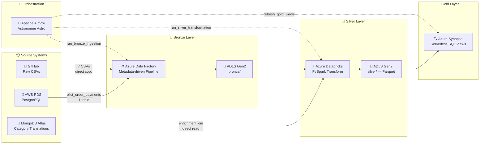

# End-To-End_BigData_Project
<div align="center">

# 🛒 Olist E-Commerce — End-to-End Big Data Pipeline

<p align="center">
  
  
  
  
  
  
  
</p>

<p align="center">
  
  
  
  
</p>

> A production-grade, multi-cloud data engineering pipeline built on the Brazilian E-Commerce Olist dataset.
> Implements a full **Bronze → Silver → Gold** medallion architecture across **AWS** and **Azure**,
> orchestrated end-to-end with **Apache Airflow** — built and debugged against real cloud infrastructure.

</div>

---

## 📐 Architecture



---

## 🗂️ Repo Structure

```
End-To-End_BigData_Project/
│
├── 📁 Data/Raw/                         # Source CSVs + ADF metadata config
│   ├── ForEachInput.json                # Metadata-driven pipeline config
│   └── olist_*.csv                      # 8 Olist dataset files
│
├── 📁 Notebooks/
│   ├── Ingestion/                       # One-time seed: CSVs → RDS + MongoDB
│   │   └── DataIngestion_PostgrSQL&MongoDB.ipynb
│   └── Databricks_Silver/               # PySpark: Bronze → Silver transform
│       └── Olist E-Commerce Data Pipeline.ipynb
│
├── 📁 Airflow/                          # Astronomer Astro project
│   ├── dags/
│   │   ├── olist_pipeline.py            # ⭐ Main chained DAG (Bronze→Silver→Gold)
│   │   ├── olist_adf_test.py            # Standalone ADF operator test
│   │   ├── olist_databricks_test.py     # Standalone Databricks operator test
│   │   └── olist_synapse_test.py        # Standalone Synapse operator test
│   ├── tests/dags/
│   │   └── test_dag_example.py          # DAG integrity + import tests
│   ├── include/
│   │   └── bootstrap_connections.sh     # Recreate Airflow Connections from env
│   ├── .env.example                     # Env var template (no real values)
│   └── Dockerfile                       # Astro Runtime 3.2-5
│
├── 📁 Synapse/                          # Git-integrated Synapse artifacts
│   ├── pipeline/refresh-gold-views.json
│   └── sqlscript/                       # Gold views + stored procedure
│
├── 📁 .github/workflows/
│   └── ci.yml                           # CI: DAG tests on every Airflow/ push
│
├── INFRASTRUCTURE.md                    # Cloud resources, RBAC, known gotchas
└── README.md
```

---

## 🔄 Pipeline Stages

### 🥉 Bronze — Raw Ingestion via Azure Data Factory
A **metadata-driven** ADF pipeline reads `ForEachInput.json` from GitHub to dynamically iterate over 7 CSVs, copying them directly into ADLS Gen2 `bronze/`. The 8th file (`olist_order_payments`) is pulled from a live **AWS RDS PostgreSQL** instance via a dedicated linked service — the only file that flows through a real source database rather than static files.

### 🥈 Silver — PySpark Transformation via Azure Databricks
A serverless PySpark notebook reads all 8 Bronze files and joins them into a single enriched `final_df`, additionally pulling `product_category_name_translation` directly from **MongoDB Atlas** for category enrichment. Key transformations:
- Date parsing and delivery delay calculation (`actual_delivery_time`, `estimated_delivery_time`, `delay`)
- Payments pre-aggregated to one row per `order_id` (eliminates cartesian fan-out from multi-installment payment rows)
- Duplicate column deduplication across the join chain
- Output written as **Parquet** to ADLS Gen2 `silver/`

### 🥇 Gold — Serverless SQL Views via Azure Synapse
Six live views query Silver Parquet via `OPENROWSET` — no materialization, no CETAS. Views are always automatically fresh against whatever Silver contains:

| View | Grain | Description |
|------|-------|-------------|
| `gold.final` | item | Full joined dataset from Silver |
| `gold.delivered_orders` | item | Filtered to `order_status = 'delivered'` |
| `gold.category_sales` | item | Revenue + order count by product category (`SUM(price)`, not `payment_value`) |
| `gold.monthly_sales` | order | Revenue trend over time (order-collapsed before aggregation) |
| `gold.delivery_performance_by_state` | order | Avg delay and late-order rate by state |
| `gold.seller_performance` | seller | Revenue and delay metrics per seller |

---

## 🎼 Orchestration

The `olist_pipeline` DAG chains all three layers in sequence with a `>>` dependency chain:

```python
run_bronze_ingestion >> run_silver_transformation >> refresh_gold_views
```

| Task | Operator | What it does |
|------|----------|-------------|
| `run_bronze_ingestion` | `AzureDataFactoryRunPipelineOperator` | Triggers ADF pipeline, waits for completion |
| `run_silver_transformation` | `DatabricksRunNowOperator` | Triggers Databricks job by ID, waits for completion |
| `refresh_gold_views` | `AzureSynapseRunPipelineOperator` | Runs `EXEC gold.refresh_gold_views` in Synapse |

All three operators validated standalone before chaining. DAG runs daily (`@daily`), `catchup=False`, `retries=2` with 5-minute retry delay.

---

## ✅ CI

GitHub Actions runs DAG integrity tests on every push that touches `Airflow/`:

```
✔ No DAG import errors
✔ All DAGs have tags
✔ All DAGs have retries ≥ 2
```

Tests run inside the actual Astro Runtime container via `astro dev pytest` — not a mocked/pip-installed Airflow — so the test environment matches production exactly.

---

## 🚀 Getting Started

### Prerequisites
- Docker Desktop + WSL2 (Ubuntu)
- [Astro CLI](https://docs.astronomer.io/astro/cli/install-cli)
- Azure subscription with ADF, Databricks, Synapse, and ADLS Gen2 provisioned
- AWS RDS PostgreSQL instance with `olist_order_payments` seeded
- MongoDB Atlas cluster with `product_category_name_translation` seeded

See [`INFRASTRUCTURE.md`](./INFRASTRUCTURE.md) for the full resource inventory, RBAC configuration, and known gotchas.

### Run Locally

```bash
# 1. Clone the repo
git clone https://github.com/MokshJaiswal/End-To-End_BigData_Project.git
cd End-To-End_BigData_Project/Airflow

# 2. Set up environment variables
cp .env.example .env
# Fill in real values in .env (see INFRASTRUCTURE.md for where to find each)

# 3. Start Airflow
astro dev start

# 4. Bootstrap Airflow Connections from env vars
astro dev bash -s
bash include/bootstrap_connections.sh
exit

# 5. Open Airflow UI
# http://localhost:8080  (admin / admin)

# 6. Run tests
astro dev pytest tests/dags/test_dag_example.py
```

---

## 📊 Dataset

[Brazilian E-Commerce Public Dataset by Olist](https://www.kaggle.com/datasets/olistbr/brazilian-ecommerce) — 100k orders from 2016–2018 across multiple Brazilian marketplaces. The dataset is static and historical; the pipeline reprocesses the same data on each scheduled run (designed to demonstrate orchestration mechanics rather than incremental ingestion).

---

## ⚠️ Known Limitations

- **Static dataset** — no incremental load, no late-arriving data, no schema drift handling
- **No automated data-quality checks** beyond DAG-level import/integrity tests
- **Infrastructure-as-Code** not implemented — manual provisioning documented in `INFRASTRUCTURE.md`
- **Kafka** integration descoped

---

<div align="center">

Built by [Moksh Jaiswal](https://github.com/MokshJaiswal)

</div>
